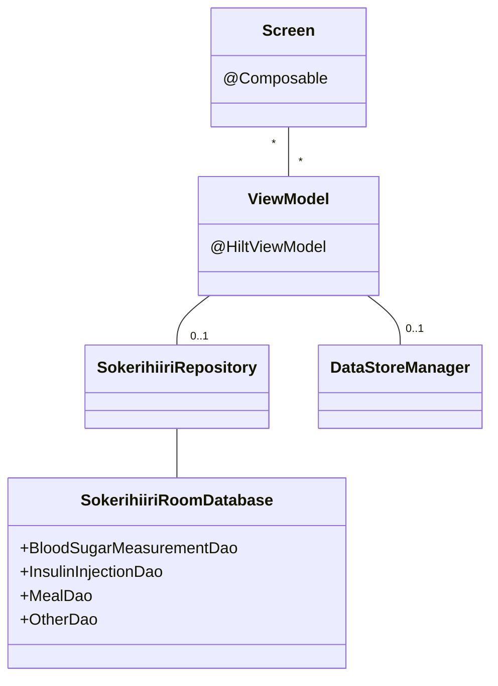

# Ruutu

Jokainen ruutu tai näkymä koostuu yhdestä tai useammasta `@Composable`-funktiosta, joiden ui-tilat ovat `ViewModel`-luokissa. Muutokset ViewModeleissa oleviin ui-tiloihin aiheuttavat uudelleenkokoonpanon, mikä mahdollistaa sovelluksen reaaliaikaisen päivittymisen käyttäjän toimien mukaan.

ViewModelit voivat hakea ja päivittää tietokannassa olevaa tietoa Repository-luokan avulla. DataStoreManager mahdollistaa muiden arvojen, kuten käyttäjän määrittelemien oletusarvojen hakemisen ja päivittämisen. 



# Tiedon tallennus

Tietokanta sisältää neljä taulua, joissa jokaisessa säilytetään tietyntyyppisiä käyttäjän kirjaamia tapahtumia. Alla olevassa kuvassa kenttien tyypit on merkattu vastaamaan sovelluksissa käytettäviä tyyppejä, mutta `Room` muuttaa tyypit pohjalla toimivalle SQLitelle sopivaan muotoon:

- Int -> INTEGER
- String -> TEXT
- float -> REAL
- Boolean -> INTEGER


ViewModel-luokat käyttävät tietokantaa SokerihiiriRepository-luokan avulla. Repositorio tarjoaa kaikista tauluista Flown, jota ViewModel voi tarkkailla, ja jonka muutoksiin se voi reagoida uudelleenpiirtämällä ui:n. Repositorio tarjoaa myös kutsuttavia `@WorkerThread` funktioita, joiden avulla voidaan lisätä, muokata tai poistaa tauluissa olevia tietoja.

Kaikki mahdolliset tietokantakyselyt on määritelty tiedostossa repository/DAOs.kt

Sovellus käyttää DataStorea oletusarvojen tallentamiseen, sekä tiedon välittämiseen `InsulinRemainderWorker`:lle.

# Datan tuominen ja vieminen

Kaiken tietokannassa olevan datan saa vietyä csv-tiedostoihin käyttäjän valitsemaan hakemistoon. Csv-tidostojen rakenne on seuraavanlainen:

```csv
Sep=;
#measurements
date;value;time_from_meal;comment
```

Ensimmäisellä rivillä määritellään erotin. Suurin etu tässä on se, että excel osaa avata ja näyttää tiedoston sisällön suoraan oikein. Toisella rivillä on tieto siitä, mitä tiedosto sisältää. Sovellus päättää tämän rivin perusteella, mitä funktiota se käyttää tiedoston tietojen lukemiseen. Kolmannella rivillä on otsikot, jonka jälkeen alkaa varsinainen data.

Sovelluksen tietokannassa olevan datan voi korvata csv-tiedostossa olevalla datalla. Tämä on hyödyllistä esimerkiksi silloin, kun käyttäjä haluaa siirtää datan toiselle laitteelle.
