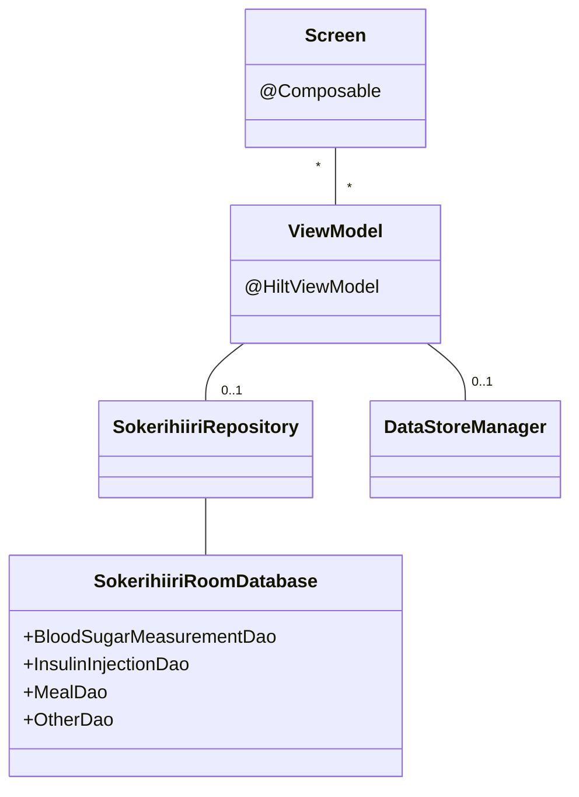

# Ruutu

Jokainen ruutu tai näkymä koostuu yhdestä tai useammasta `@Composable`-funktiosta, joiden ui-tilat ovat `ViewModel`-luokissa. Muutokset ViewModeleissa oleviin ui-tiloihin aiheuttavat uudelleenkokoonpanon, mikä mahdollistaa sovelluksen reaaliaikaisen päivittymisen käyttäjän toimien mukaan.

ViewModelit voivat hakea ja päivittää tietokannassa olevaa tietoa Repository-luokan avulla. DataStoreManager mahdollistaa muiden arvojen, kuten käyttäjän määrittelemien oletusarvojen hakemisen ja päivittämisen. 

# Tietokanta

Tietokanta sisältää neljä taulua, joissa jokaisessa säilytetään tietyntyyppisiä käyttäjän kirjaamia tapahtumia. Alla olevassa kuvassa kenttien tyypit on merkattu vastaamaan sovelluksissa käytettäviä tyyppejä, mutta `Room` muuttaa tyypit pohjalla toimivalle SQLitelle sopivaan muotoon:

- Int -> INTEGER
- String -> TEXT
- float -> REAL
- Boolean -> INTEGER

