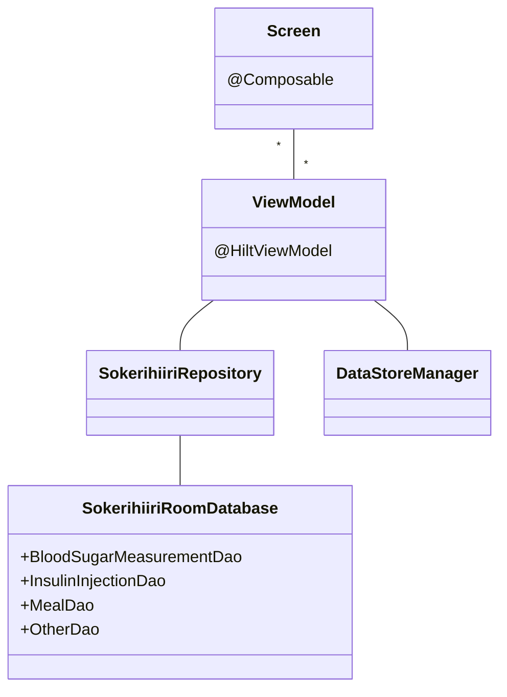

# Ruutu

Jokainen ruutu tai näkymä koostuu yhdestä tai useammasta `@Composable`-funktiosta, joiden ui-tilat ovat `ViewModel`-luokissa. Muutokset ViewModeleissa oleviin ui-tiloihin aiheuttavat uudelleenkokoonpanon, mikä mahdollistaa sovelluksen reaaliaikaisen päivittymisen käyttäjän toimien mukaan.

